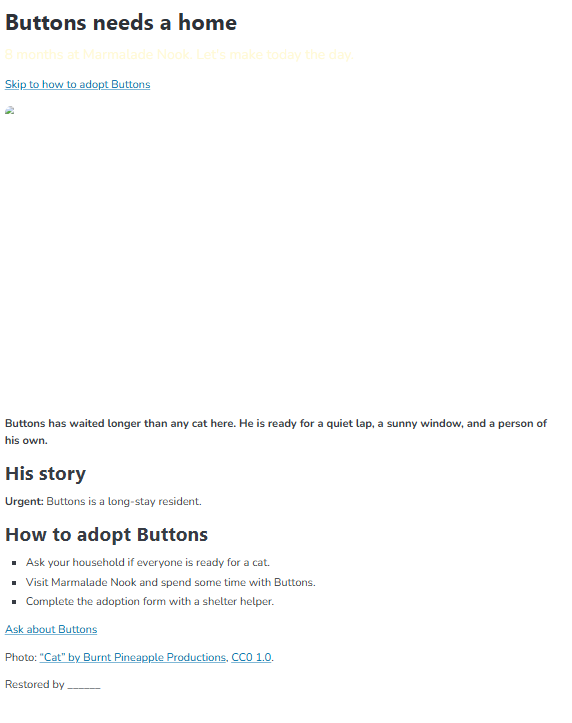
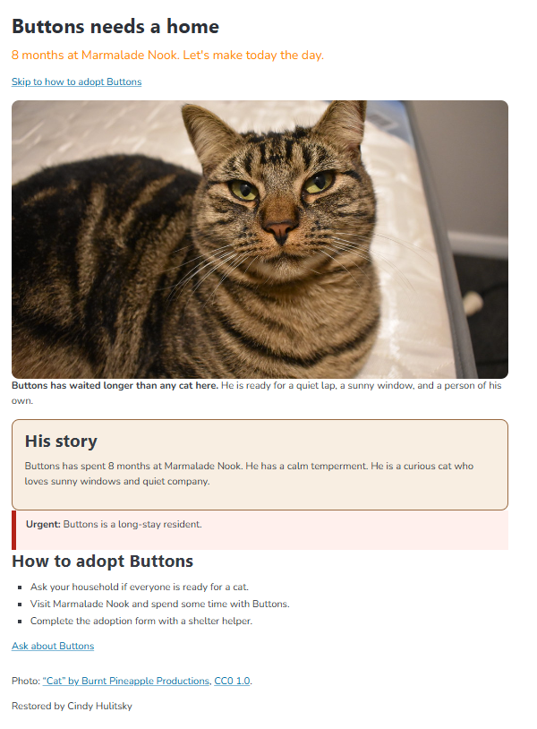

# Buttons' Rescue

This is the adoption page for Buttons.  He's been at Marmalade Nook Animal Shelter for 8 months.  I inherited a broken page, with a list of issues to fix.  I filed the issues and fixed them.

## Before and After

# What I fixed

1)Show Buttons photo.
2)Fix overuse of 'bold'.
3)Fix the 'skip line jump' for "go to How to Adopt Buttons".
4)Put 'His Story' in a box.
5)Close the 'photo rule' in css so the style for 'story' shows.
6)Dark Orange tagline reads on white better and goes with warm tones.
7)Describe Buttons photo for everyone.
8)Write Buttons' story.

## Credits

Photo:"Cat" by Burnt Pineapple Productions, CC0 1.0.
Live page:https://sndymrn13.github.io/buttons-rescue/